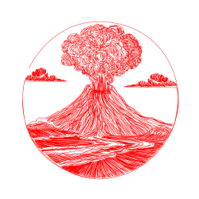

# 🎨 Sand Table Patterns Collection

> Beautiful, mesmerizing patterns for kinetic sand tables - ready to download and use!

## ✨ Overview

This repository contains a curated collection of **800+ pattern files** designed for kinetic sand tables (also known as Zen tables or sand plotters). Each pattern creates unique, meditative designs in sand, ranging from geometric spirals to artistic illustrations.

### 📸 Sample Patterns

  
  

## 🚀 Quick Start

1. **Browse patterns** in the [`patterns/`](./patterns) directory
2. **Preview designs** in the [`previews/`](./previews) directory
3. **Download** the `.thr` files you like
4. **Upload** to your sand table controller
5. **Enjoy** watching your sand table create beautiful art!

## 🔧 Compatibility

These patterns are designed in **Theta-Rho (`.thr`) format**, which uses polar coordinates to define the sand table's arm movements. Compatible with:

- [Dune Weaver](https://github.com/tuanchris/dune-weaver)
- [Sisyphus Tables](https://sisyphus-industries.com)
- Custom DIY sand tables that support `.thr` format

## 🏷️ Keywords

kinetic sand table, zen table, sand plotter, theta-rho, thr patterns, sisyphus table, sandsara, meditation art, kinetic art, sand patterns, zen patterns, sand art, automated sand drawing, polar coordinates, kinetic sculpture

---

⭐ **Star this repository** if you find these patterns useful!

🔔 **Watch for updates** to get notified about new patterns
